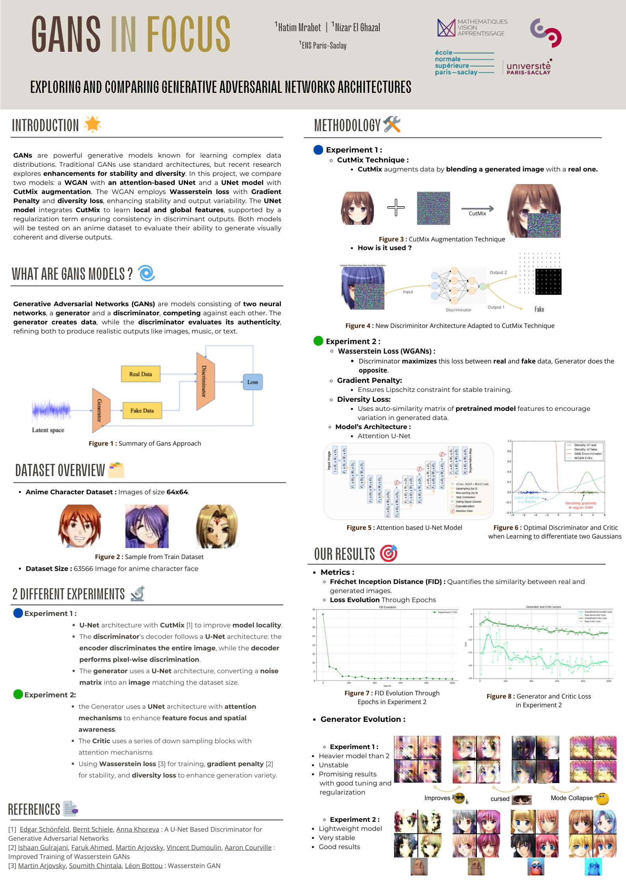

# GANs In Focus: Exploring and Comparing Generative Adversarial Networks Architectures



## Introduction 🌟
Generative Adversarial Networks (GANs) have revolutionized image synthesis, enabling the generation of realistic images from random noise. However, standard GAN training often requires extensive computational resources and large datasets. In this project, we investigate two lightweight GAN architectures aimed at achieving high-quality low-resolution image synthesis with reduced computational costs:

1. **CutMix U-Net GAN**: Incorporates a U-Net discriminator with pixel-wise and image-level supervision, enhanced by CutMix augmentation for local detail preservation.
2. **Attention WGAN**: Integrates attention mechanisms into a U-Net-based generator and critic while leveraging a feature diversity loss using pretrained image embeddings.

Both models are evaluated on an anime face dataset (64x64 resolution), emphasizing efficiency and quality under limited resources.

---
## What are GANs? 🤔
GANs consist of two neural networks trained adversarially:
- **Generator (G):** Produces synthetic images from random noise.
- **Discriminator (D):** Differentiates between real and generated images.

The two networks engage in a minimax game, pushing the generator to improve until it can fool the discriminator.

---
## Dataset Overview 📂

We use an **Anime Character Dataset** from [Kaggle by Spencer Churchill and Brian Chao](https://www.kaggle.com/datasets/splcher/animefacedataset)

- **Dataset Size:** 63,566 images of anime character faces, We choose a subset of the most recent 10,000 images resized to **64x64** pixels

---
## Methodology 🛠️

### Model 1: GAN with CutMix Augmentation 🎨
#### Key Features:
- **U-Net Architecture:** Used for both the generator and discriminator, allowing spatial information preservation via skip connections.
- **Dual-Output Discriminator:** Produces both global (image-level) and local (pixel-level) authenticity outputs.
- **CutMix Augmentation:** Blends real and generated images during training to improve discriminator robustness and fine-grained detail supervision.

#### Loss Functions:
- **Discriminator Loss:** Combines image-level Binary Cross Entropy (BCE) and pixel-wise BCE losses.
- **Generator Loss:** Aims to fool both the image-level and pixel-level outputs of the discriminator.

#### CutMix Formula:
Given two images $x_A$ and $x_B$, a mixed image is created as:

$$ \tilde{x} = M \odot x_A + (1 - M) \odot x_B $$

Where $M$ is a binary mask with a random rectangular region set to 1.

---
### Model 2: Attention WGAN with Diversity Loss 🤖
#### Key Features:
- **Attention-Enhanced U-Net Generator:** Focuses on critical image regions during upsampling.
- **Attention-Based Critic:** Introduces attention layers in downsampling blocks to improve feature selectivity.
- **Wasserstein Loss (WGAN):** Optimizes Wasserstein distance for more stable training.
- **Gradient Penalty:** Enforces Lipschitz constraint.
- **Feature Diversity Loss:** Encourages sample diversity by penalizing similarity in feature space (pretrained ResNet-18 embeddings).

#### Loss Functions:
- **Critic Loss:** Wasserstein loss with gradient penalty.
- **Generator Loss:** Includes Wasserstein loss and diversity loss.

---
## Training Procedure 💡
### CutMix U-Net GAN:
1. **Discriminator Update (k = 5 per generator update):**
   - Sample real and generated images.
   - Apply CutMix augmentation with increasing probability.
   - Compute image-level and pixel-level BCE losses.

2. **Generator Update:**
   - Sample noise and generate images.
   - Optimize against both discriminator outputs.

### Attention WGAN:
1. **Critic Update (k = 5 per generator update):**
   - Sample real and generated images.
   - Compute Wasserstein loss and gradient penalty.

2. **Generator Update:**
   - Sample noise and generate images.
   - Optimize using Wasserstein loss and diversity loss.

---
## Results & Observations 🎯
### Evaluation Metric:
- **Fréchet Inception Distance (FID):** Measures similarity between real and generated images.

### Key Insights:
- **CutMix U-Net GAN:**
  - Sharp local details and fine-grained textures.
  - Prone to instability; CutMix introduces computational overhead.

- **Attention WGAN:**
  - Stable training with globally coherent samples.
  - Slightly less sharp but more consistent.


---
## Installation & Usage 🚀
### Prerequisites
```bash
pip install torch torchvision numpy matplotlib
```

You can test the models by running the two notebooks `Cutmix_GAN.ipynb` and `Attention_WGAN.ipynb` 

---
## Discussion & Limitations 💭
- **CutMix GAN:**
  - Pros: High local detail.
  - Cons: Computationally heavier, unstable training.

- **Attention WGAN:**
  - Pros: Stable, globally coherent samples.
  - Cons: Slightly less sharp, relies on pretrained features.

**General Limitations:**
- Low resolution (64x64).
- Dataset-specific results (anime faces).
- Diversity loss mitigates but doesn't eliminate mode collapse.

---
## References 📚
1. Edgar Schönfeld et al., 2020. [A U-Net Based Discriminator for GANs](https://arxiv.org/abs/2002.12655)
2. Ishaan Gulrajani et al., 2017. [Improved Training of Wasserstein GANs](https://arxiv.org/abs/1704.00028)
3. Martin Arjovsky et al., 2017. [Wasserstein GAN](https://arxiv.org/abs/1701.07875)
4. Sangdoo Yun et al., 2019. [CutMix: Regularization Strategy to Train Strong Classifiers](https://arxiv.org/abs/1905.04899)

---
## License 📝
This project is licensed under the MIT License.

Feel free to reach out for inquiries or contributions!